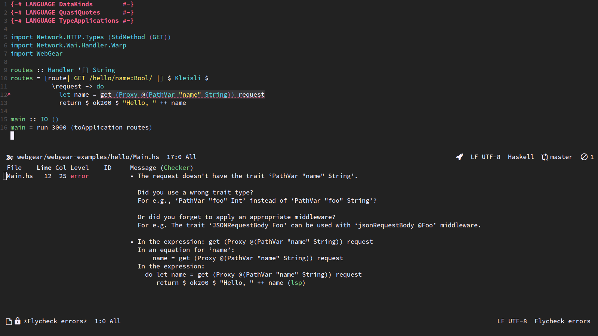

# Welcome to WebGear
WebGear is a Haskell library to build composable, extensible, and type-Safe HTTP APIs.

WebGear uses advanced Haskell features to give you type-safe web applications but all that magic is kept carefully under
the hood. Thus you'll find an easy learning curve even without advanced Haskell knowledge. WebGear also boasts of
friendly error messages that helps to quickly detect and correct problems with your code.

## Hello WebGear
Here is a fully functional WebGear application. If you access <http://localhost:3000/hello/Legolas>, you'd get a `200
OK` response with the body `Hello, Legolas`.

```hs
{-# LANGUAGE DataKinds, QuasiQuotes, TypeApplications #-}

import Network.HTTP.Types (StdMethod (GET))
import Network.Wai.Handler.Warp
import WebGear

routes :: Handler '[] String
routes = [route| GET /hello/name:String |] $
           Kleisli $
             \request -> do
                let name = get (Proxy @(PathVar "name" String)) request
                return $ ok200 ("Hello, " ++ name)

main :: IO ()
main = run 3000 (toApplication routes)
```

## Developer Friendly
WebGear is built on a small set of simple concepts which makes it approachable. You don't need to be a Haskell Guru to
build APIs with WebGear. Friendly error messages will guide you when you make mistakes.



## Composability
APIs are built by composing functions to form handlers and middlewares. Build complex APIs from smaller simpler parts!

```hs
putWidget = method @PUT
            $ requestContentTypeHeader @"application/json"
            $ jsonRequestBody @Widget
            $ jsonResponseBody @Widget
            $ putWidgetHandler
```

## Extensibility
Every component of WebGear can be replaced with alternative implementations should you wish so. Your custom middlewares
are as first-class as the ones provided by WebGear.

APIs run with the framework of your choice. WebGear can work with monad transformers or algebraic effect systems that
you want to use.
